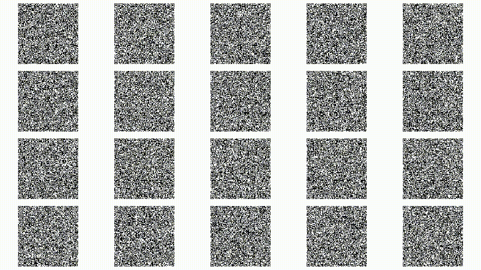

# QRVid

Encode arbitrary binary data into QR code videos for YouTube storage, and
decode it back from a downloaded video.



## How it works

1. **Chunking** — input data is split into chunks (default 300 bytes each).
   Every chunk gets a 20-byte header (magic, version, flags, total chunks,
   index, chunk length, total data length, CRC32).
2. **Optional compression** — gzip level 9 (`--compress`).
3. **Optional encryption** — AES-256-GCM with PBKDF2 key derivation.
4. **QR encoding** — each chunk is rendered as a QR code (error correction H /
   30%). Multiple QRs are laid out on a 1920×1080 H.264 video frame in a
   `cols`×`rows` grid (default 6×5 = 30 QRs/frame).
5. **Parallel frame generation** — frames are rendered in parallel using a
   process pool (`--workers`).
6. **Optional PAR2 recovery** — recovery blocks are generated from the
   (compressed+encrypted) data and transmitted as FSK audio in the video's
   audio track using `minimodem` (`--recovery N`).
7. **Video assembly** — layouts are written sequentially, each held for N
   frames (default 3 @ 30 fps ≈ 0.1 s). YouTube minimum duration is enforced
   with trailing black frames.
8. **Decoding** — audio is extracted and demodulated for PAR2 recovery blocks.
   The video is scanned in parallel; QRs are detected with `pyzbar` (falling
   back to OpenCV). Duplicate payloads are discarded by hash.
9. **PAR2 repair** — if chunks are missing, the audio-recovered PAR2 blocks
   automatically repair them.
10. **Reconstruction** — chunks are re-ordered by index, data is concatenated,
    optionally decrypted, optionally decompressed, and CRC32 is verified.

## Requirements

- Python 3.8+
- [zbar](https://github.com/mchehab/zbar) shared library (for pyzbar)
- [par2cmdline](https://github.com/Parchive/par2cmdline) (for PAR2 recovery)
- [minimodem](https://github.com/kamalmostafa/minimodem) (for audio recovery channel)
- ffmpeg (for audio merging)

### macOS (Homebrew)

```bash
brew bundle
```

### Linux (apt)

```bash
sudo apt install libzbar0 par2 minimodem ffmpeg
```

### Windows

Download a pre-built zbar DLL or use `choco install zbar`.

## Install

```bash
pip install -r requirements.txt
```

## Usage

### Encode

```bash
# Basic
python qrvid.py enc myfile.bin -o myfile.mp4

# Encrypt with a password (AES-256-GCM + PBKDF2)
python qrvid.py enc myfile.bin -o myfile.mp4 --password "hunter2"

# More QRs per frame, longer hold time
python qrvid.py enc myfile.bin -o myfile.mp4 --qpf 4 --hold 6

# Pipe data via stdin
cat myfile.bin | python qrvid.py enc - -o myfile.mp4
```

### Decode

```bash
# Decode a local video
python qrvid.py dec myfile.mp4 -o restored.bin

# Decrypt with password
python qrvid.py dec myfile.mp4 -o restored.bin --password "hunter2"

# Decode from a YouTube URL (downloads first)
python qrvid.py dec "https://youtu.be/..." -o restored.bin

# Decode to stdout
python qrvid.py dec myfile.mp4 > restored.bin
```

### Options (encode)

| Flag | Default | Description |
|------|---------|-------------|
| `--fps` | 30 | Video frame rate |
| `--hold` | 3 | Frames to display each QR layout |
| `--gap` | 0 | White separator frames between layouts |
| `--box-size` | 8 | QR module size in pixels |
| `--cols` | 6 | QR code columns per frame |
| `--rows` | 5 | QR code rows per frame |
| `--max-duration` | — | Split output into segments of this many min each |
| `--workers` | cpu−1 | Parallel workers for frame generation |
| `--compress` | — | Gzip data before encoding |
| `--verify` | — | Decode output after encoding to check integrity |
| `--recovery` | 0 | Generate N PAR2 recovery blocks (transmitted via audio) |
| `-p` / `--password` | — | Encrypt with this password |

## Benchmarking

The `benchmark.py` script tests grid layouts for data loss and speed:

```bash
# All layouts with default 1 MB file
python benchmark.py

# Specific size and layouts
python benchmark.py --size 100K --layouts 6x5,5x4,4x4

# Test with extra qrvid.py flags (use -- separator)
python benchmark.py --size 1M --layouts 6x5,5x4 -- --compress --hold 1

# Test YouTube re-encode (after uploading):
python benchmark.py --youtube "https://youtu.be/..."
```

Output columns: Layout, Video (bytes), Duration, Chunks, Loss (missing),
Encode time.

## Capacity

With defaults (6×5 = 30 QPF, 3 hold at 30 fps, 480 bytes/chunk):

| Duration | Frames | QRs | Raw data | Encrypted |
|---------|-------|-----|---------|-----------|
| 30 min | 54,000 | 1,620,000 | ~740 MB | ~740 MB |
| 1 hour | 108,000 | 3,240,000 | ~1.4 GB | ~1.4 GB |
| 12 hours | 1,296,000 | 38,880,000 | ~17 GB | ~17 GB |

Tune `--cols`, `--rows`, `--hold`, and `--box-size` to trade density for
readability (denser = more data but more sensitive to compression artifacts).
Use `--compress` to shrink data before encoding. Use `--verify` to check
layout reliability for your specific file.

## Format

Header (20 bytes, little-endian):

```
Offset  Size  Field
 0       4     MAGIC          "QRVD"
 4       1     format_version  2
 5       1     flags          Bit 0: gzip compressed
 6       2     total_chunks
 8       2     chunk_index
10       2     chunk_len      bytes of data in this chunk
12       4     total_len      original data length
16       4     crc32          CRC-32 of data (pre-encryption)
```

Each chunk payload = header (20) + data (max 480). Chunks are padded by
repeating the last to align with `cols × rows`.

## Project files

- `qrvid.py` — single-file CLI tool (subcommands: `enc`, `dec`)
- `requirements.txt` — Python dependencies
- `test_data.bin` — 5 KB random data for round-trip testing
